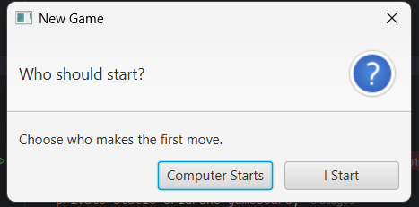
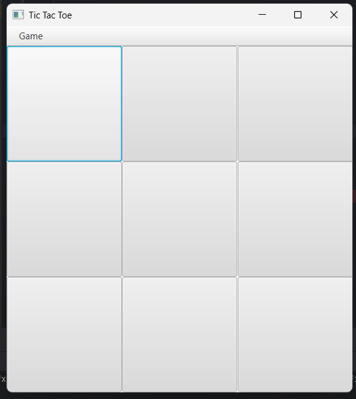
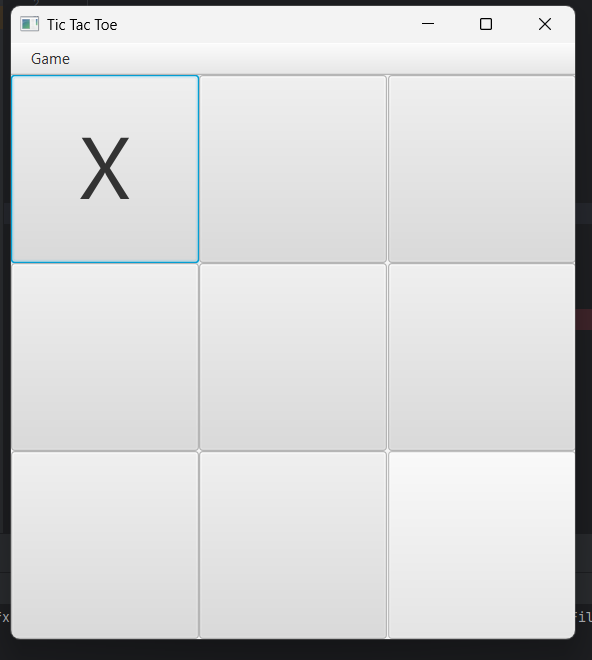
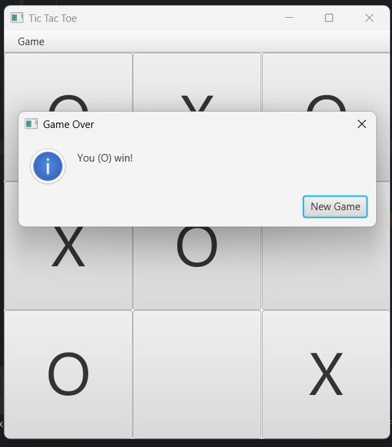
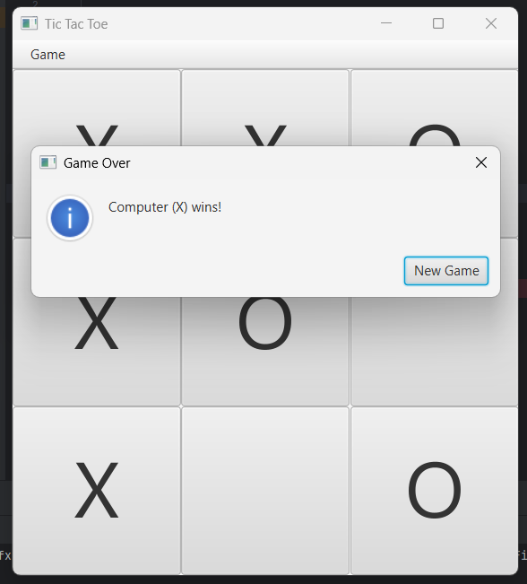

# 🎮 Tic Tac Toe - JavaFX

A simple and interactive **Tic Tac Toe game built using JavaFX**, featuring an AI opponent powered by the **Minimax algorithm**.

The game allows the player to choose who starts first — the **Computer** or the **Player** — and provides a graphical user interface for playing Tic Tac Toe.

---

## ✨ Features

- 🎮 Interactive Tic Tac Toe GUI
- 🤖 AI opponent using the Minimax algorithm
- 👤 Player vs Computer gameplay
- 🔄 Choose who starts the game
- 🆕 New Game option
- 🏆 Automatic winner detection
- 🤝 Draw detection
- ❌ Computer plays as `X`
- ⭕ Player plays as `O`
- 🖥️ Built with JavaFX

---

## 🛠️ Technologies Used

- **Java 21**
- **JavaFX 21**
- **Minimax Algorithm**
- **IntelliJ IDEA**
- **Git & GitHub**

---

## 📂 Project Structure

```text
TicTacToe-JavaFX/
│
├── screenshots/
│   ├── start-game.png
│   ├── gameplay_user_start.png
│   ├── gameplay_computer_start.png
│   ├── player-wins.png
│   └── computer-wins.png
│
├── TicTacToe/
│   └── src/
│       ├── ai/
│       │   ├── MiniMax.java
│       │   ├── MiniMaxAlphaBeta.java
│       │   ├── MiniMaxCombined.java
│       │   └── MiniMaxImproved.java
│       │
│       └── game/
│           ├── Board.java
│           ├── Mark.java
│           └── TicTacToe.java
│
├── .gitignore
└── README.md
```

---

## 🎯 How the Game Works

The game has two players:

- **Computer → X**
- **Player → O**

When the game starts, you can choose:

- **Computer Starts**
- **I Start**

### If Computer Starts

The AI makes the first move and the player responds.

### If Player Starts

The player makes the first move and the AI responds.

The game continues until:

- Computer wins
- Player wins
- The board is completely filled, resulting in a draw

---

## 🤖 AI Implementation

The computer player uses the **Minimax algorithm** to determine its moves.

The AI evaluates possible game states and selects a move based on the resulting game positions.

The project contains different Minimax implementations:

- `MiniMax`
- `MiniMaxAlphaBeta`
- `MiniMaxCombined`
- `MiniMaxImproved`

The current game uses:

```java
MiniMaxCombined.getBestMove(board);
```

---

## 🚀 How to Run

### 1. Clone the Repository

```bash
git clone https://github.com/YOUR_USERNAME/TicTacToe-JavaFX.git
```

### 2. Open the Project

Open the project in **IntelliJ IDEA**.

### 3. Configure Java

Make sure **JDK 21** is installed.

Check your Java version:

```bash
java -version
```

### 4. Configure JavaFX

Download and configure **JavaFX 21**.

Add the JavaFX libraries to the project.

### 5. Configure VM Options

In IntelliJ:

**Run → Edit Configurations → VM Options**

Add:

```text
--module-path "C:\javafx\javafx-sdk-21.0.11\lib" --add-modules javafx.controls
```

> Update the JavaFX path if you extracted the SDK somewhere else.

### 6. Run the Application

Run the main class:

```text
game.TicTacToe
```

The Tic Tac Toe game window will open.

---

## 🎮 Controls

| Action | Description |
|---|---|
| Click a tile | Place your `O` |
| Game → New Game | Start a new game |
| Computer Starts | AI makes the first move |
| I Start | Player makes the first move |

---

## 🏆 Game Results

The game displays:

```text
You (O) win!
```

or

```text
Computer (X) wins!
```

or

```text
Draw!
```

---

## 📸 Screenshots

### 🎮 Choose Who Starts

At the beginning of each game, you can choose whether the **Computer** or **Player** makes the first move.



### 👤 Player Starts

The player can choose to make the first move.



### 🤖 Computer Starts

The computer can also make the first move using the AI.



### 🏆 Player Wins

The game automatically detects when the player wins.



### 🤖 Computer Wins

The game automatically detects when the computer wins.


---

## 🔮 Future Improvements

- 🎨 Improve the user interface
- 🔊 Add sound effects
- 🏅 Add score tracking
- 🎚️ Add difficulty levels
- 🌐 Add multiplayer mode
- 📊 Add game statistics
- ✨ Add animations and visual effects

---

## 👨‍💻 Author

**Sanjay**

Computer Science & Engineering

---

## 📄 License

This project is available for educational and learning purposes.
